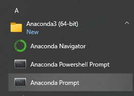

# Vanilla Fire Mage Simulation

This application simulates a team of fire mages casting against a single boss level target within the framework of Classic Era mechanics.

### Installation

Here are the steps to install and run the application on Windows.
1. Under the "Code" link above, download a ZIP file and extract it into a directory such as "C:\sims\"
2. Download the Anaconda package: [tested version](https://repo.anaconda.com/archive/Anaconda3-2023.07-2-Windows-x86_64.exe)
3. From the Start menu, open an Anaconda Prompt (see below)
4. Go to the directory you extracted the code to in Step 1 using the "cd" command.  For the above example, ```cd \sims\fire-mage-simulation```
5. Run the application with ```python -m src.gui.main```
  


## Walkthrough

### Scenario Editor

### Stat Weights/Distribution Run

### Setting up Multiple Scenarios

### Scenario Comparison Run


### Crit equivalency comparisons

Here are some results from other simulations:
* [Quasexort](https://docs.google.com/spreadsheets/d/1dqFuQeNVa403ulrmuW_8Ww-5UszOde0RPMBe2g7t1g4)
* [elio](https://github.com/ignitelio/ignite/blob/master/magus2.ipynb)

### Acknowledgement
*Thanks to elio for tracking down the error in ignite timing and providing parallel code sample!*
*Thanks to alzy for the sim result comparison, which helped pin down a bug in the scorch refresh logic!*
