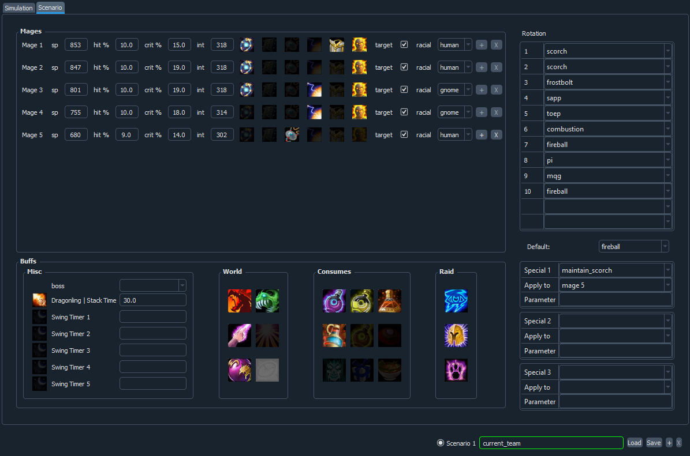
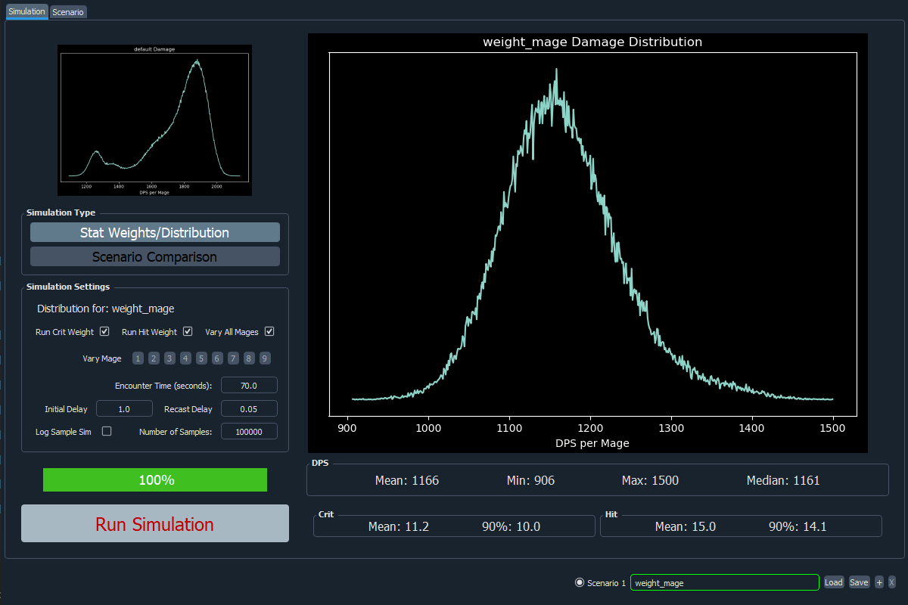
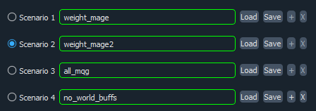
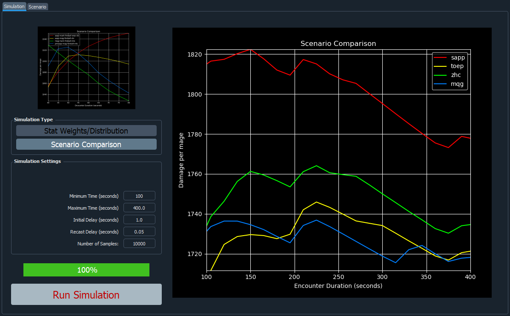

# Vanilla Fire Mage Simulation

This application simulates a team of fire mages casting against a single boss level target within the framework of Classic Era mechanics.

### Installation

Here are the steps to install and run the application on Windows.
1. Under the green "Code" link above, select "download ZIP"
2. Extract the ZIP file into a directory such as "C:\sims\"
3. Download and install the Anaconda package: [tested windows version](https://repo.anaconda.com/archive/Anaconda3-2023.07-2-Windows-x86_64.exe)
4. From the Start menu, open an Anaconda Prompt (see below)
5. Go to the directory you extracted the code to in Step 2 using the "cd" command.  For the above example, ```cd \sims\fire-mage-simulation```
6. Run the application with ```python -m src.gui.main```
  


## Walkthrough
### Scenario Editor
Start by selecting the Scenario editor tab on the top left.


#### Directly Editing Stats
Within the **Mages** section you can change the stats and other attributes of each mage.  The stats should be entered as from gear/enchant only for spell power, hit, and crit.  Int should be entered as base value + gear, with no buffs.  The trinket section informs the sim which active trinkets are available.  Next are indicators for the UDC set bonus and whether the mage can receive PI.  For now, only one PI per mage can be available.  *Target* indicates whether that mage's personal DPS and their share of the ignite are included in the output.  The expected output for only one mage on the team can be analyzed by checking only a single *target* box.  Next there are three aura indicators for Mage, Warlock, and Boomkin.  Only other in-party members are counted here, self auras are not.  Buttons on the far right (for the bottom mage) increase or decrease the number of mages.

#### Loading Sixty Upgrades
As an alterative to directly editing stats, they can be automatically populated by loading a character export from the excellent website [sixtyupgrades](https://sixtyupgrades.com).  To do so, make a character on the website, and export it to file.  Save the exported character to the directory ```.\data\characters\``` within the simulation installation.  Then from the scenario editor, if you click "Mage 1", the exported charater should be available to load within the simulator.  Importing a sixtyupagrades character automatically sets stats, trinkets, and set bonuses.  These attributes can no longer be adjusted.  Target, PI, and the auras are still adjustable as they are independent of gear.  To release a mage to be adjusted manually again, click the name again.

### Rotation
The **Rotation** section has an initial fixed set of rotation commands that each mage attempts to cast when the fight start.  Abilities that are not available to a mage are not cast and do not expend any time.  For example if "mqg" is on the list but a mage doesn't have Mind Quickening Gem, when they get to that cast in the sequence it is ignored.  The *Special* section assigns one or more mage to a continuing rotation in which usually scorch is cast given a set of conditions.  Other mages spam the default spell once the initial rotation is complete.  Details about the *special* rotations are given in the tooltip.  After the initial rotation, and unless contradicted by a special ruleset, abilities that are on cooldown (combustion, trinkets, etc...) will be recast when they become available.

### Stat Weights/Distribution Run
In the bottom right scenario selection panel, type in "weight_mage" for Scenario 1, and then press "Load".  Switch to the Simulation tab and run the sim with default paramters.  The output should look like this:



Lety's play around with a few of the scenario and simulation settings.
* Go back to the Scenario tab and change the "Special 1" rotation to "cobimf" for mage 3.
* Rerun the Stat weights.  You should see a slight increase in DPS.
* In the **Simualtion Settings** panel, deselect "Vary All Mages" and then click on all the numbers except 1.  This looks at the effect of changing only the stats for Mage 1 to calculate the stat weights.  So the **DPS** output should not be affected, but **Crit** and **Hit** will be.  You should see the crit valuation go up a few SP points.  Crit is more important for the well geared Mage 1 than it is for the team aggregate.
* Return to the Scenario tab and deselect *target* for all mages but Mage 1.  Rerun the simulation and you should see much higher DPS values.

### Setting up Multiple Scenarios
The scenario selection panel is on the bottom right of the application.  Here you can load/save scenarios and add/remove multiple scenarios.  The selection button on the left indicates which scenario is shown and edited in the scenario editor as well as the scenario that is run for stat weight/distribution type simulations.



### Scenario Comparison Run
A Scenario Comparison Run plots all scenarios in the selection panel as a function of encounter time.



### Crit equivalency comparisons
Here are some results from other simulations:
* [Quasexort](https://docs.google.com/spreadsheets/d/1dqFuQeNVa403ulrmuW_8Ww-5UszOde0RPMBe2g7t1g4)
* [elio](https://github.com/ignitelio/ignite/blob/master/magus2.ipynb)

### Acknowledgement
*Thanks to elio for tracking down the error in ignite timing and providing parallel code sample!*
*Thanks to alzy for the sim result comparison, which helped pin down a bug in the scorch refresh logic!*
